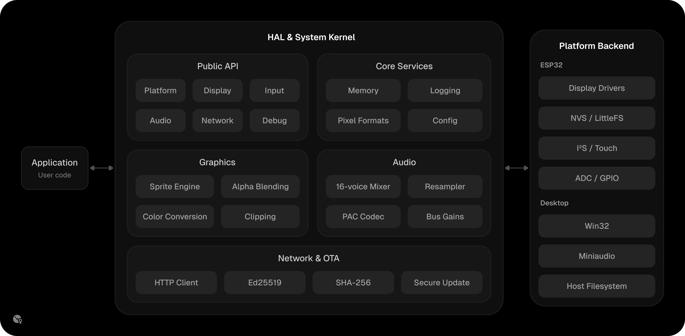

  

  <a href="../README.md">English</a> &nbsp;&nbsp; <strong>Українська</strong> &nbsp;&nbsp; <a href="RU.md">Русский</a> 
  ▔▔▔▔▔▔

PipCore - це легковагий високопродуктивний рівень апаратних абстракцій (HAL) та системне ядро, розроблене спеціально для мікроконтролерів.

  

Ядро забезпечує ефективний доступ до платформи, роботу з GPIO та АЦП, а також асинхронний двобуферний DMA-драйвер дисплеїв для панелей ST7789, ST7796 та ILI9488. Рушій спрайтів працює безпосередньо в RGB565: відсікання за маскою, швидкі 32-бітні операції з апаратним байт-свопом і програмне альфа-змішування. Введення - ємнісний тач та аналогові джойстики, звук - програмний мікшер на 16 голосів із вбудованим форматом PAC поверх I2S.

Для зберігання є файлові системи LittleFS і налаштування на базі NVS. З мережевого - подієвий сервіс Wi-Fi та неблокуючий OTA-оновлювач із перевіркою підпису маніфесту за Ed25519 і контролем цілісності за SHA256. Вбудований симулятор для Windows виконує той самий код ядра на десктопі (відтворення кадрів, емуляція введення), також створення PNG-скріншотів і запис MP4-відео.

> **Попередження**
>
> Драйвер ILI9488 наразі перебуває на експериментальній стадії. Стабільна робота не гарантується, і деякі модулі дисплея можуть демонструвати несподівану поведінку залежно від апаратного забезпечення та конфігурації.

  <strong>Ресурси</strong>&emsp;&emsp;&emsp;<strong>Потрібен в</strong> 
  <a href="https://pisppus.is-a.dev/docs/pipcore">Доки</a>&nbsp;&nbsp;&nbsp;&nbsp;&nbsp;&nbsp;&nbsp;&nbsp;&nbsp;&emsp;&nbsp;&nbsp;&emsp;<a href="https://github.com/pisppus/PipKit">PipKit</a> 
  <a href="https://components.espressif.com/components/pisppus/pipcore">Registry</a>&emsp;&emsp;&emsp;&emsp;<a href="https://github.com/pisppus/Pip3D">Pip3D</a>

  Розповсюджується за ліцензією MIT.

